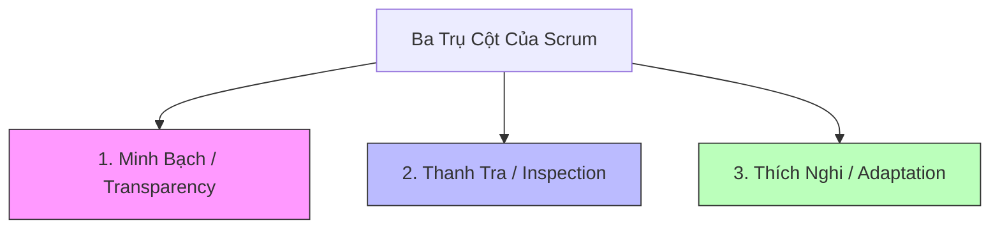
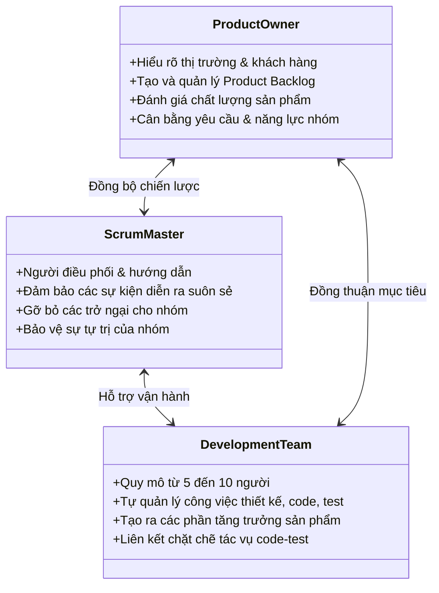
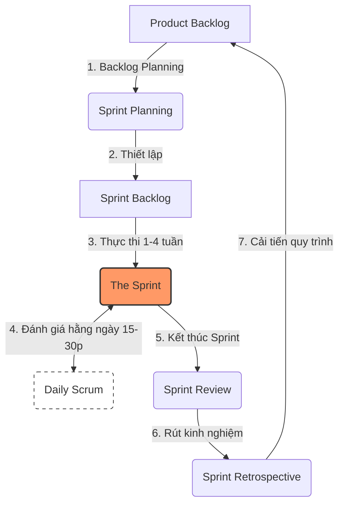

# 🔄 Cẩm Nang Toàn Diện Về Khung Vận Hành Scrum (Scrum Framework Playbook)

Tài liệu này hệ thống hóa toàn bộ kiến thức nền tảng, giá trị cốt lõi, vai trò, sự kiện và quy trình vận hành thực tế của **Scrum** [180]. Đây là một trong những phương pháp phổ biến và mạnh mẽ nhất thuộc mô hình Agile [181], giúp tăng tính linh hoạt, cải thiện tốc độ phát triển và tối ưu hóa chất lượng sản phẩm công nghệ [181].

Tài liệu được thiết kế làm cẩm nang vận hành chính thức, bổ sung vào kho lưu trữ của đội ngũ sản phẩm nhằm chuẩn hóa tư duy và quy trình làm việc liên chức năng.

---

## 🗺️ Sự Khác Biệt Giữa Agile Và Scrum

Rất nhiều người thường nhầm lẫn giữa hai khái niệm này. Thực tế, chúng có mối quan hệ tương hỗ giữa "Tư duy" và "Hành động" [188]:

| Đặc Điểm | 💡 Triết Lý Agile | ⚙️ Khung Vận Hành Scrum |
| :--- | :--- | :--- |
| **Bản chất** | Là một **tư duy (mindset)** và triết lý về sự linh hoạt, thích nghi nhanh [188]. | Là một **phương pháp thực thi cụ thể (methodology/framework)** để hiện thực hóa tư duy Agile [188]. |
| **Thành phần** | Gồm **4 giá trị** cốt lõi và **12 nguyên tắc** định hướng [188]. | Gồm các **vai trò, sự kiện, giá trị** và quy tắc vận hành rõ ràng [182, 184, 187]. |
| **Mức độ** | Trừu tượng, mang tính định hướng chung ở cấp độ vĩ mô [188]. | Cụ thể, thực tế và dễ dàng áp dụng trực tiếp vào dự án [188, 189]. |
| **Lợi ích** | Tạo nền tảng văn hóa linh hoạt cho tổ chức [188]. | Rút ngắn thời gian phát triển và tối đa hóa hiệu suất làm việc của nhóm [189]. |

---

## 🏛️ Ba Trụ Cột Của Scrum (The Three Pillars)

Sự thành công của mô hình Scrum được duy trì dựa trên ba trụ cột nền tảng nhằm đảm bảo tính tự trị và khả năng tự kiểm soát của đội ngũ [182]:

1. **Minh Bạch (Transparency):** Mọi thông tin liên quan đến sản phẩm như tầm nhìn, nhu cầu của khách hàng, tiến độ công việc, khó khăn hiện tại... đều phải được công khai rõ ràng [183]. Sự minh bạch này giúp toàn bộ các bộ phận có đầy đủ dữ liệu để phối hợp và đưa ra quyết định chính xác nhất [183].
2. **Thanh Tra (Inspection):** Các hoạt động trong Scrum phải được kiểm tra và đánh giá thường xuyên nhằm phát hiện kịp thời các lỗi sai hoặc lệch hướng [183]. Điều này giúp đội ngũ chủ động ngăn chặn rủi ro trước khi chúng gây ảnh hưởng lớn đến sản phẩm [183].
3. **Thích Nghi (Adaptation):** Khi phát hiện ra vấn đề thông qua quá trình thanh tra, đội ngũ phải nhanh chóng định hình lại hướng đi và điều chỉnh quy trình [183]. Khả năng thích nghi cao giúp đội ngũ vận hành mượt mà hơn, mang lại hiệu quả tối ưu và kết quả tốt nhất cho khách hàng [183].

---

## 💎 Năm Giá Trị Cốt Lõi Của Scrum (Scrum Values)

Nếu ba trụ cột là khung xương kỹ thuật thì năm giá trị cốt lõi chính là linh hồn văn hóa giúp nhóm Scrum làm việc gắn kết và hiệu quả [189]:

*   **Can Đảm (Courage):** Các thành viên có đủ sự tự tin để bày tỏ quan điểm, ý kiến cá nhân [189]. Ở cấp độ nhóm, sự can đảm thể hiện ở việc dám đưa ra những quyết định đột phá, thử nghiệm những giải pháp táo bạo [189].
*   **Tập Trung (Focus):** Toàn đội chỉ tập trung vào một mục tiêu Sprint rõ ràng thay vì phân rã sức lao động vào quá nhiều tác vụ dàn trải [189].
*   **Cam Kết (Commitment):** Từng cá nhân tự sắp xếp công việc và cam kết nỗ lực hết mình để hoàn thành xuất sắc các mục tiêu đã đồng thuận [189].
*   **Tôn Trọng (Respect):** Thừa nhận rằng không ai hoàn hảo [189]. Sự tôn trọng, lắng nghe và đoàn kết giữa các thành viên là chìa khóa để giải phóng 100% năng lực sáng tạo của tập thể [189].
*   **Cởi Mở (Openness):** Sẵn sàng chia sẻ khi gặp khó khăn hoặc lỗi lầm [189]. Thành viên không im lặng chịu đựng mà cởi mở để đồng đội hỗ trợ tìm giải pháp chung [189].

---

## 👥 Ba Vai Trò Trực Thuộc Nhóm Scrum (Scrum Roles)

Một nhóm Scrum tiêu chuẩn có quy mô nhỏ gọn, hoạt động độc lập và tự quản lý với ba vai trò cốt lõi có trách nhiệm rõ ràng [187]:

1. **Product Owner (Chủ Sở Hữu Sản Phẩm - PO):** Là người có sự hiểu biết sâu sắc về sản phẩm, thị trường và khách hàng [187, 190]. PO chịu trách nhiệm tạo ra các nhiệm vụ, quản lý Product Backlog và đóng vai trò là **người đánh giá chất lượng sản phẩm** [187, 194]. PO phải khéo léo cân bằng giữa mong muốn của khách hàng với năng lực thực tế của đội ngũ [187].
2. **Scrum Master (Người Điều Phối Scrum - SM):** Đóng vai trò là **người hướng dẫn và điều phối dự án** [187, 194]. SM đảm bảo toàn bộ các sự kiện trong Scrum diễn ra suôn sẻ đúng quy định, giúp tháo gỡ khó khăn và bảo vệ môi trường tự trị của nhóm phát triển [187].
3. **Development Team (Nhóm Phát Triển - Dev Team):** Là nhóm liên chức năng trực tiếp thực thi xây dựng sản phẩm, bao gồm các lập trình viên, kiểm thử viên (testers), nhà thiết kế... [187]. Quy mô lý tưởng của Dev Team là từ **5 đến 10 người** [187]. Nhóm có quyền tự quản lý cách thức hoàn thành công việc của mình [182].

---

## 🔄 Các Sự Kiện Trong Scrum (Scrum Events) & Quy Trình Vận Hành

Quy trình hoạt động của Scrum là một chuỗi các sự kiện lặp đi lặp lại liên tục để tạo ra các phần tăng trưởng sản phẩm hoàn chỉnh [184]:

### 1. Backlog Planning (Lập Kế Hoạch Backlog)
*   **Mục đích:** PO liên tục tìm hiểu thị trường, khách hàng và thu thập phản hồi từ các bên liên quan để đưa ra định hướng sản phẩm chính xác [190].
*   **Hoạt động:** PO tổng hợp và sắp xếp danh sách các nhiệm vụ, tính năng cần thiết (Product Backlog) để chuẩn bị cho giai đoạn phát triển tiếp theo [190].

### 2. Sprint Planning (Lập Kế Hoạch Sprint)
*   **Thời điểm:** Diễn ra ngay trước khi một Sprint mới bắt đầu [185].
*   **Hoạt động:** Toàn bộ nhóm họp lại để thống nhất các nội dung từ Product Backlog chuyển sang Sprint Backlog [191]. Cuộc họp chia làm 3 phần cốt lõi [185]:
    *   *Phần 1 (Why):* PO trình bày lý do tại sao các hạng mục này cần được thực hiện. Toàn đội thảo luận và đồng thuận về **Sprint Goal (Mục tiêu Sprint)** [185].
    *   *Phần 2 (What):* Dev Team thảo luận với PO để chọn ra các hạng mục công việc cụ thể từ Product Backlog đưa vào Sprint Backlog [185].
    *   *Phần 3 (How):* Dev Team bàn bạc về giải pháp, công cụ và cách thức thực hiện chi tiết để đạt được mục tiêu đề ra [185].

### 3. The Sprint (Chu Kỳ Sprint)
*   **Bản chất:** Là "trái tim" của khung vận hành Scrum [184]. Đây là một khoảng thời gian cố định kéo dài từ **1 đến 4 tuần** để đội ngũ tập trung hoàn thiện các hạng mục đã cam kết [184, 191].
*   **Quy tắc:** Sprints diễn ra liên tiếp và không bị ngắt quãng [184]. Khi thời gian của một Sprint kết thúc, sự kiện này sẽ dừng lại ngay lập tức bất kể công việc đã hoàn thành hay chưa [184]. Ngay khi kết thúc một Sprint, Sprint tiếp theo phải được bắt đầu ngay lập tức để duy trì tính liên tục của dự án [194].

### 4. Daily Scrum / Daily Sprint (Họp Hằng Ngày)
*   **Mục đích:** Đồng bộ thông tin, theo dõi tiến độ và điều chỉnh công việc hằng ngày [186, 192].
*   **Hoạt động:** Cuộc họp ngắn gọn kéo dài từ **15 đến 20 phút** (nếu làm việc từ xa - remote thì có thể tối đa **30 phút**) diễn ra tại một khung giờ và địa điểm cố định để tạo thành thói quen [186, 194]. Từng thành viên trả lời nhanh:
    *   Hôm qua tôi đã hoàn thành việc gì? [192]
    *   Hôm nay tôi sẽ làm việc gì? [192]
    *   Tôi đang gặp phải khó khăn hay trở ngại nào? [192]

### 5. Sprint Review (Sơ Kết / Đánh Giá Sprint)
*   **Thời điểm:** Diễn ra khi Sprint kết thúc [186].
*   **Hoạt động:** Toàn đội cùng các bên liên quan và khách mời tiến hành demo, chạy thử nghiệm sản phẩm thực tế để đánh giá các phần việc đã hoàn thành [186, 194]. PO thu thập phản hồi và đưa ra quyết định cuối cùng về việc có **phát hành (release) sản phẩm ra thị trường** hay không, đồng thời cập nhật lại kế hoạch cho các giai đoạn tiếp theo [193].

### 6. Sprint Retrospective (Cải Tiến Sprint)
*   **Thời điểm:** Diễn ra sau sự kiện Sprint Review [193].
*   **Hoạt động:** Đây là cuộc họp nội bộ để nhìn nhận lại toàn bộ quy trình vận hành trong Sprint vừa qua [193]. Nhóm sẽ cùng chỉ ra những mặt đã làm tốt, những điểm thiếu sót và đề xuất các giải pháp cải tiến thực tế cho Sprint tiếp theo [193]. 
*   **Thành phần tham gia:** Dev Team, Scrum Master và khách mời bắt buộc phải tham gia; Product Owner có thể không cần tham gia sự kiện này [187].

---

## ⚠️ Các Lưu Ý Quan Trọng Khi Áp Dụng Thực Tế

Để triển khai Scrum thành công và tránh rơi vào bẫy "bình mới rượu cũ" (chỉ đổi tên cuộc họp nhưng giữ nguyên cách làm việc cũ), đội ngũ cần tuyệt đối tuân thủ các nguyên tắc sau [194]:

1.  **Tính liên tục tuyệt đối của Sprint:** Cuối một Sprint, nhóm phải bắt đầu ngay Sprint tiếp theo [194]. Việc này tạo ra một nhịp độ làm việc (cadence) ổn định và giúp dự án liên tục tịnh tiến [184, 194].
2.  **Liên kết chặt chẽ giữa Lập trình và Kiểm thử:** Trong mỗi Sprint, các thành viên không được tách rời công việc phát triển và kiểm thử [194]. Việc lập trình và chạy thử nghiệm (testing) phải được thực hiện song song, tạo thành các tác vụ liên kết chặt chẽ với nhau để tối ưu hóa thời gian và ngăn ngừa lỗi tồn đọng [194].
3.  **Lập kế hoạch trước, thực thi sau:** Luôn luôn dành thời gian lập kế hoạch kỹ lưỡng trước khi bắt tay vào code và test [194]. Sau khi hoàn thiện, bắt buộc phải có bước chạy thử nghiệm thực tế và demo sản phẩm để nghiệm thu [194].
4.  **Linh hoạt ứng phó với thay đổi:** Scrum không phải là một quy trình cứng nhắc [194]. Đội ngũ cần duy trì sự nhạy bén, sẵn sàng tiếp nhận các phản hồi thay đổi yêu cầu và chủ động giải quyết ngay các vấn đề phát sinh để bảo vệ tiến độ chung [194].

---

*Tài liệu này được hệ thống hóa trực tiếp từ tài liệu "What is Scrum? What is the difference between Scrum and Agile?" của Viindoo, tích hợp sâu sắc với phương pháp luận quản lý sản phẩm của Roman Pichler để mang lại góc nhìn vận hành thực chiến tối ưu nhất.*