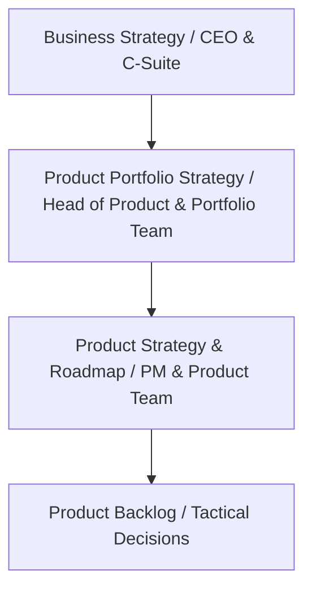
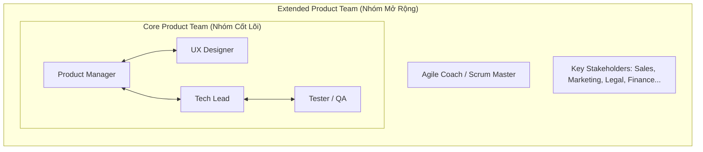

# Cơ cấu Tổ chức Đội ngũ Sản phẩm (Product Team Structures)

Tài liệu này cung cấp cái nhìn chi tiết và toàn diện về các mô hình cấu trúc đội ngũ phát triển sản phẩm dựa trên **Mô hình Vận hành Sản phẩm (Product Operating Model)**.
---

## 1. Bản chất: Chuyển dịch từ Dự án (Project) sang Sản phẩm (Product)

Trong mô hình truyền thống, phần mềm thường được xây dựng thông qua một chuỗi các dự án ngắn hạn do một Quản lý Dự án (Project Manager) dẫn dắt, với thước đo thành công là bàn giao đúng hạn, đúng phạm vi và trong ngân sách. Tuy nhiên, mô hình này dễ gây mất mát kiến thức, đứt gãy thông tin sau bàn giao và thiếu sự gắn kết lâu dài.

Ngược lại, **Mô hình Vận hành Sản phẩm (Product Operating Model)** tổ chức công việc xung quanh các sản phẩm sống động được quản lý bởi các **đội ngũ sản phẩm bền vững (enduring product teams)** nhằm tối ưu hóa giá trị thực tế mang lại cho người dùng và doanh nghiệp.

---

## 2. Mô hình Đội ngũ Sản phẩm: Nhóm Cốt lõi & Nhóm Mở rộng (Roman Pichler)

Để vận hành thành công và đưa ra các quyết định chiến lược đúng đắn, đội ngũ sản phẩm không hoạt động cô lập mà được tổ chức thành hai lớp phối hợp nhịp nhàng:

### Nhóm Cốt lõi (Core Product Team)
Chịu trách nhiệm trực tiếp nghiên cứu (discovery) và xây dựng (delivery) sản phẩm hàng ngày:
*   **Quản lý Sản phẩm (Product Manager - PM / Product Owner):** Có thẩm quyền cao nhất đối với toàn bộ sản phẩm và đưa ra quyết định cuối cùng nếu đội ngũ không đạt được sự đồng thuận. Chịu trách nhiệm tối đa hóa giá trị sản phẩm, xây dựng chiến lược, lộ trình (roadmap) và quản lý backlog.
*   **Thiết kế Trải nghiệm Người dùng (UX Designer):** Tập trung vào việc thấu hiểu người dùng, thiết kế giao diện (UI/UX), vẽ wireframe và đảm bảo tính dễ sử dụng của sản phẩm.
*   **Trưởng nhóm Kỹ thuật (Tech Lead) & Lập trình viên:** Đảm bảo tính khả thi về kỹ thuật, xây dựng kiến trúc hệ thống, viết mã nguồn sạch và bàn giao sản phẩm.
*   **Kỹ sư Kiểm thử (QA / Tester):** Đảm bảo chất lượng, kiểm thử tự động, phát hiện lỗi để sản phẩm vận hành ổn định.

### Nhóm Mở rộng (Extended Product Team)
Được thành lập khi đội ngũ cần đưa ra các quyết định chiến lược hoặc thương mại hóa sản phẩm:
*   **Các Bên liên quan chính (Key Stakeholders):** Đại diện từ Marketing, Sales, Chăm sóc khách hàng (Support), Pháp lý (Legal), Tài chính (Finance) đóng góp chuyên môn cần thiết để đảm bảo sản phẩm phù hợp với mô hình kinh doanh của doanh nghiệp.
*   **Huấn luyện viên Đội ngũ (Agile Coach / Scrum Master):** Đóng vai trò điều phối các cuộc họp, giải quyết xung đột, thúc đẩy sự cộng tác hiệu quả và giải phóng PM khỏi gánh nặng điều phối để tập trung vào sản phẩm.

---

## 3. 10 Mô hình Cơ cấu Đội ngũ Sản phẩm (Product Team Structures)

Dưới đây là chi tiết về 10 cách tổ chức đội ngũ phát triển sản phẩm phổ biến nhất:

### 1. Mô hình Squad (The Squad Model / Spotify Model)
*   **Mô tả:** Các nhóm liên chức năng nhỏ hoạt động độc lập (tự trị) tập trung hoàn toàn vào một mảng sản phẩm hoặc một vấn đề cụ thể (ví dụ: luồng đăng ký hoặc giỏ hàng). Nhóm tự quản lý mục tiêu và backlog riêng.
*   **Ưu điểm (Pros):**
    *   Tính tự chủ cao giúp đưa ra quyết định và thử nghiệm cực kỳ nhanh.
    *   Tăng tính sở hữu (ownership) đối với từng tính năng cụ thể.
*   **Nhược điểm (Cons):**
    *   Dễ tạo ra các "ốc đảo" thông tin (silos) nếu thiếu giao tiếp xuyên suốt.
    *   Nguy cơ không đồng bộ về tiêu chuẩn thiết kế hoặc công nghệ giữa các Squad.
*   **Phù hợp nhất (Best for):** Các startup hoặc tổ chức Agile cần tốc độ cải tiến và lặp lại nhanh chóng.

### 2. Mô hình Bộ ba (Triad Structure)
*   **Mô tả:** Cấu trúc nhấn mạnh sự hợp tác chặt chẽ của bộ ba cốt lõi: Quản lý sản phẩm (PM), Thiết kế (Designer) và Trưởng nhóm kỹ thuật (Tech Lead). Họ cùng nhau đưa ra mọi quyết định từ chiến lược, thiết kế cho đến kỹ thuật.
*   **Ưu điểm (Pros):**
    *   Đưa ra quyết định cân bằng giữa mục tiêu kinh doanh, trải nghiệm người dùng và tính khả thi kỹ thuật.
    *   Giảm thiểu tối đa khoảng cách giữa lập kế hoạch chiến lược và thực thi kỹ thuật.
*   **Nhược điểm (Cons):**
    *   Phụ thuộc rất lớn vào kỹ năng giao tiếp và mối quan hệ giữa ba thành viên này.
    *   Có thể xảy ra tình trạng trì trệ nếu giữa ba người xảy ra bất đồng lớn không thể hòa giải.
*   **Phù hợp nhất (Best for):** Các doanh nghiệp quy mô vừa đến lớn muốn tối ưu hóa tính khả thi và trải nghiệm người dùng ngay từ giai đoạn khám phá sản phẩm (Product Discovery).

### 3. Nhóm theo Tính năng (Feature-Based Teams)
*   **Mô tả:** Đội ngũ được tổ chức và quản lý xoay quanh các tính năng hoặc mô-đun cụ thể của sản phẩm xuyên suốt vòng đời sản phẩm.
*   **Ưu điểm (Pros):**
    *   Độ chuyên môn hóa và tinh thần trách nhiệm đối với tính năng đó rất cao.
    *   Dễ dàng phân bổ nguồn lực dựa trên mức độ ưu tiên của tính năng.
*   **Nhược điểm (Cons):**
    *   Dễ bị "tầm nhìn hạn hẹp" (tunnel vision), chỉ tập trung vào tính năng của mình mà quên đi bức tranh lớn của toàn bộ sản phẩm.
    *   Tạo ra nhiều sự phụ thuộc chéo (dependencies) giữa các nhóm tính năng làm chậm tiến độ tổng thể.
*   **Phù hợp nhất (Best for):** Các sản phẩm phần mềm có nhiều mô-đun công cụ riêng biệt dành cho người dùng.

### 4. Nhóm theo Dòng Sản phẩm (Product Line Teams)
*   **Mô tả:** Tổ chức dựa trên các dòng sản phẩm khác nhau trong danh mục của công ty. Mỗi nhóm hoạt động độc lập như một đơn vị kinh doanh nhỏ (mini-business unit) sở hữu từ chiến lược, phát triển cho đến vận hành dòng sản phẩm đó.
*   **Ưu điểm (Pros):**
    *   Chuyên môn hóa sâu sắc cho từng nhóm khách hàng và mảng thị trường riêng biệt.
    *   Dễ dàng quản lý danh mục sản phẩm lớn ở quy mô tập đoàn.
*   **Nhược điểm (Cons):**
    *   Thiếu linh hoạt khi cần chuyển dịch nguồn lực giữa các dòng sản phẩm.
    *   Dễ dẫn đến sự cạnh tranh nội bộ về tài nguyên và ngân sách.
*   **Phù hợp nhất (Best for):** Các công ty đa sản phẩm (Multi-product SaaS) hoặc tập đoàn có danh mục dịch vụ đa dạng.

### 5. Nhóm Cân bằng Luồng công việc (Stream-Aligned Teams)
*   **Mô tả:** Các đội ngũ được thiết kế đi liền với luồng giá trị cốt lõi của khách hàng (Customer Journey) hoặc các mục tiêu kinh doanh chiến lược lớn nhằm liên tục chuyển giao giá trị mà không bị gián đoạn.
*   **Ưu điểm (Pros):**
    *   Tập trung tối đa vào việc chuyển giao giá trị liên tục (continuous value delivery).
    *   Gắn liền trực tiếp với kết quả kinh doanh thực tế.
    *   Giảm thiểu các khâu chuyển giao bàn giao (handoffs) gây chậm trễ.
*   **Nhược điểm (Cons):**
    *   Khó duy trì tính nhất quán về công nghệ và trải nghiệm trên toàn bộ hệ thống.
    *   Đòi hỏi sự tái thiết lập mục tiêu thường xuyên khi ưu tiên của luồng công việc thay đổi.
*   **Phù hợp nhất (Best for):** Các tổ chức có hệ thống vận hành phức tạp, nơi tốc độ phản hồi khách hàng là yếu tố sống còn.

### 6. Mô hình Pod (Pod Structure)
*   **Mô tả:** Tương tự như Squad nhưng có quy mô nhỏ hơn và thậm chí tự trị cao hơn nữa. Pod thường sở hữu lộ trình (roadmap) và backlog riêng biệt, đồng thời có thể tích hợp cả nhân sự ngoài khối sản phẩm như Marketing hoặc Customer Success để tối ưu hóa đầu ra.
*   **Ưu điểm (Pros):**
    *   Cực kỳ linh hoạt, cơ động và có khả năng tự cung tự cấp toàn diện.
    *   Phối hợp liên chức năng rộng hơn, hướng trực tiếp đến kết quả kinh doanh.
*   **Nhược điểm (Cons):**
    *   Dễ xảy ra xung đột quyền lợi và ưu tiên giữa các Pod khác nhau.
    *   Khó đồng bộ hóa trải nghiệm người dùng toàn trang do các Pod tự vận hành theo hướng riêng.
*   **Phù hợp nhất (Best for):** Các startup đang tăng trưởng nóng (scaling startups) cần thử nghiệm nhanh các hướng đi mới.

### 7. Mô hình Ma trận (Matrix Structure)
*   **Mô tả:** Mô hình báo cáo kép (dual reporting) kết hợp giữa quản lý sản phẩm và quản lý chuyên môn. Thành viên đội ngũ vừa báo cáo cho Product Manager (về tiến độ sản phẩm) vừa báo cáo cho Trưởng bộ phận chức năng (về tiêu chuẩn kỹ thuật/thiết kế).
*   **Ưu điểm (Pros):**
    *   Thúc đẩy chia sẻ kiến thức và duy trì tiêu chuẩn chuyên môn rất cao.
    *   Phân bổ tài nguyên linh hoạt giữa các dự án.
*   **Nhược điểm (Cons):**
    *   Cực kỳ dễ gây bối rối, quá tải cho nhân sự do phải báo cáo cho hai sếp.
    *   Quy trình ra quyết định có thể bị chậm lại do phải thông qua cả hai tuyến quản lý.
*   **Phù hợp nhất (Best for):** Các doanh nghiệp lớn, công ty đa quốc gia cần sử dụng tối ưu nguồn lực chuyên gia khan hiếm trên nhiều sản phẩm.

### 8. Mô hình Tập trung (Centralized Product Team)
*   **Mô tả:** Tất cả nhân sự sản phẩm báo cáo trực tiếp về một trung tâm quản lý sản phẩm duy nhất. Trung tâm này chịu trách nhiệm hoạch định toàn bộ chiến lược, thiết lập ưu tiên và ban hành các quy chuẩn vận hành chung.
*   **Ưu điểm (Pros):**
    *   Đảm bảo tính nhất quán tuyệt đối về mặt chiến lược và trải nghiệm người dùng.
    *   Dễ dàng thiết lập và thực thi các quy trình tiêu chuẩn hóa.
    *   Tối ưu hóa việc ưu tiên nguồn lực từ trên xuống dưới.
*   **Nhược điểm (Cons):**
    *   Thiếu sự linh hoạt và phản ứng chậm với các nhu cầu phát sinh cụ thể.
    *   Dễ tạo ra các rào cản hành chính, kìm hãm sự sáng tạo của các nhóm nhỏ.
*   **Phù hợp nhất (Best for):** Các startup giai đoạn đầu cần sự định hướng tập trung, đồng bộ để tối ưu hóa sản phẩm cốt lõi.

### 9. Mô hình Phân tán (Decentralized Product Team)
*   **Mô tả:** Các nhân sự sản phẩm được phân bổ và nhúng trực tiếp vào từng phòng ban chức năng hoặc đơn vị kinh doanh riêng biệt để tự phát triển chiến lược cục bộ.
*   **Ưu điểm (Pros):**
    *   Tính tự chủ và khả năng thích ứng cục bộ cực kỳ cao.
    *   Đội ngũ thấu hiểu sâu sắc nhu cầu đặc thù của thị trường hoặc tệp khách hàng mà họ phục vụ.
*   **Nhược điểm (Cons):**
    *   Rất khó để duy trì một tầm nhìn sản phẩm thống nhất trên toàn công ty.
    *   Dễ dẫn đến tình trạng trùng lặp công sức (duplicate efforts) và không nhất quán về chất lượng.
*   **Phù hợp nhất (Best for):** Các doanh nghiệp quy mô lớn sở hữu nhiều mảng kinh doanh hoặc phân khúc thị trường hoàn toàn khác biệt nhau.

### 10. Đội ngũ Toàn diện (Full-Stack Teams)
*   **Mô tả:** Đội ngũ sở hữu mọi vai trò cần thiết để tự quản lý toàn bộ vòng đời sản phẩm (từ lập chiến lược, nghiên cứu, thiết kế, phát triển, kiểm thử, triển khai cho đến cải tiến) mà không phụ thuộc vào bất kỳ phòng ban bên ngoài nào.
*   **Ưu điểm (Pros):**
    *   Sở hữu trọn vẹn (end-to-end ownership) sản phẩm của mình.
    *   Vòng lặp phát triển và cải tiến sản phẩm cực kỳ nhanh chóng.
    *   Triệt tiêu các sự phụ thuộc chéo vào các phòng ban khác.
*   **Nhược điểm (Cons):**
    *   Chi phí vận hành và duy trì đội ngũ rất lớn.
    *   Đòi hỏi nhân sự phải có năng lực đa dạng và toàn diện (khó tuyển dụng).
*   **Phù hợp nhất (Best for):** Các công ty có sản phẩm kỹ thuật phức tạp, đòi hỏi khả năng cập nhật tính năng liên tục hàng ngày.

---

## 4. Hướng dẫn 6 Bước Xây dựng Tổ chức Quản lý Sản phẩm

Để thiết lập một tổ chức quản lý sản phẩm vững mạnh, bạn nên đi theo quy trình 6 bước bài bản sau:\

1.  **Xác định Tầm nhìn & Chiến lược Sản phẩm:** Định vị rõ tầm nhìn dài hạn, kế hoạch hành động cụ thể để đạt tầm nhìn đó và cách sản phẩm hỗ trợ cho mục tiêu tăng trưởng chung của công ty.
2.  **Xác định các Vai trò Cốt lõi & Hỗ trợ:** Làm rõ ranh giới trách nhiệm để tránh chồng chéo công việc (đặc biệt là trong các đội ngũ nhỏ/startup).
3.  **Lựa chọn Mô hình Tổ chức Phù hợp:** Chọn một trong 10 mô hình trên dựa trên quy mô công ty, số lượng nhân sự và chuỗi báo cáo.
4.  **Tuyển dụng theo Giai đoạn Phát triển:**
    *   *Giai đoạn Startup:* Ưu tiên tuyển dụng nhân sự đa năng (generalists) có thể gánh vác nhiều vai trò cùng lúc.
    *   *Giai đoạn Tăng trưởng (Growth):* Bổ sung các chuyên gia chuyên sâu như UX Researcher, Product Marketing Manager (PMM), Data Analyst.
    *   *Giai đoạn Chín muồi (Mature):* Xây dựng phân cấp quản lý rõ ràng, áp dụng quản trị theo OKRs và quy trình hóa chuẩn chỉnh.
5.  **Thiết lập các Quy trình của Đội ngũ:** Đồng bộ hóa cách làm việc thông qua phương pháp Agile (Scrum/Kanban), quy trình khám phá sản phẩm (Product Discovery), và các buổi họp định kỳ.
6.  **Phát triển Lãnh đạo & Mở rộng quy mô:** Bổ sung vai trò Head of Product để dẫn dắt, quản lý danh mục sản phẩm (portfolio) và xây dựng lộ trình thăng tiến rõ ràng cho nhân viên.

---

## 5. Lời khuyên khi Lựa chọn và Vận hành Cơ cấu

*   **Tính thích ứng:** Không có bất kỳ cấu trúc nào là hoàn hảo vĩnh viễn. Đội ngũ sản phẩm là một hệ thống sống – cần liên tục đánh giá và điều chỉnh khi sản phẩm dịch chuyển qua các giai đoạn phát triển khác nhau.
*   **Sự cân bằng:** Luôn cân đối giữa **Tốc độ** (đạt được qua các mô hình tự trị như Squad, Full-stack) và **Tính nhất quán** (đạt được qua các mô hình tập trung như Centralized, Matrix).
*   **Tập trung vào Outcome thay vì Output:** Một đội ngũ sản phẩm chỉ thực sự thành công khi họ giải quyết được vấn đề của khách hàng và mang lại giá trị kinh doanh thực tế, thay vì chỉ chăm chăm đếm số lượng tính năng được code xong.

---

## 6. Tài liệu Tham khảo (References)

Tài liệu này được tổng hợp, đối chiếu và xây dựng dựa trên các nguồn tài liệu sản phẩm uy tín sau:
1.  **10 Ways to Organize Your Product Team Structure** - Phân tích chi tiết về 10 cơ cấu tổ chức đội ngũ sản phẩm, ưu nhược điểm và ngữ cảnh áp dụng thực tế.
2.  **Strategy and Product Teams** bởi *Roman Pichler* - Khái niệm nền tảng về mối quan hệ giữa Chiến lược sản phẩm và cấu trúc Nhân sự (sự phân chia giữa Core Product Team và Extended Product Team).
3.  **Succeeding with the Product Operating Model** bởi *Roman Pichler* - Hướng dẫn chuyển dịch hiệu quả sang Mô hình Vận hành Sản phẩm bền vững thay cho mô hình dự án truyền thống.
