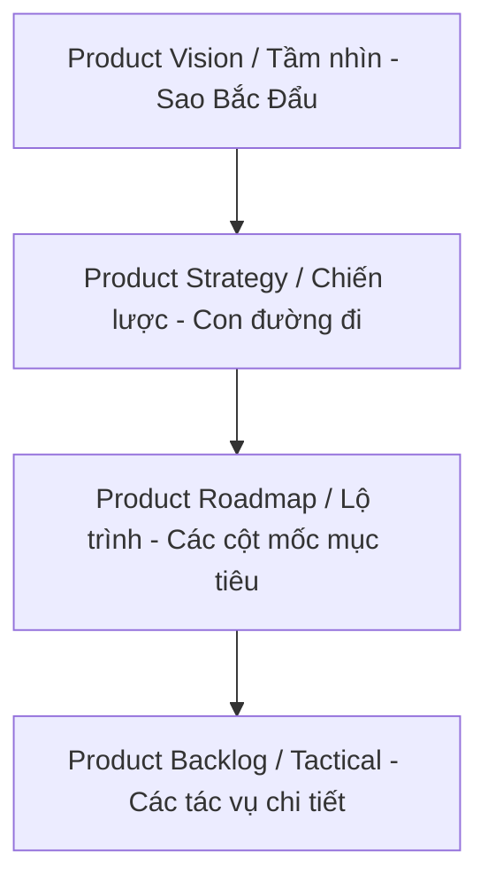
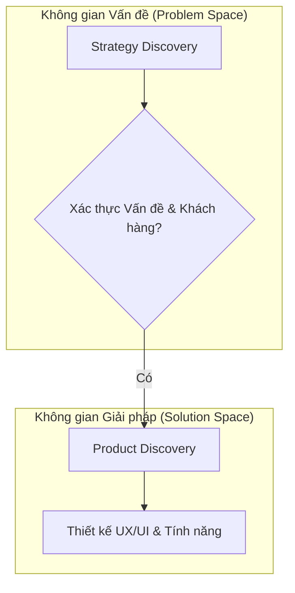
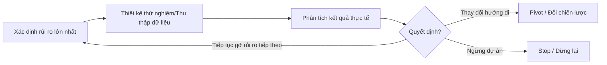
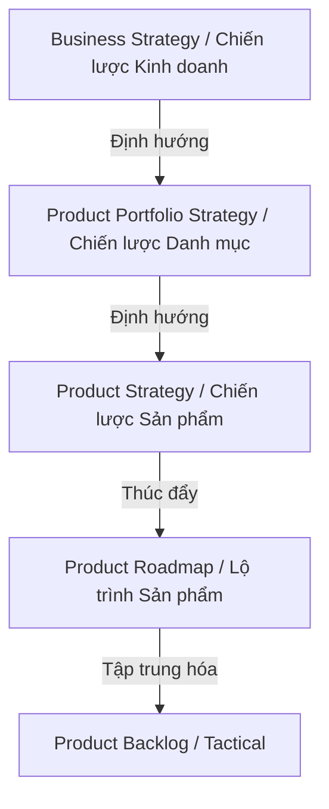

# Kiến tạo Tầm nhìn & Chiến lược Sản phẩm (Product Vision & Strategy Playbook)

Tài liệu này hệ thống hóa toàn bộ phương pháp luận của chuyên gia sản phẩm hàng đầu **Roman Pichler**, hướng dẫn chi tiết cách thiết lập một **Tầm nhìn Sản phẩm (Product Vision)** truyền cảm hứng, hoạch định một **Chiến lược Sản phẩm (Product Strategy)** vững chắc và vận hành quy trình **Khám phá Chiến lược (Strategy Discovery)** liên tục. 

---

## 1. Tầm nhìn Sản phẩm (Product Vision) - "Kim Chỉ Nam" Cho Đội Ngũ

### Bản chất của Product Vision
Tầm nhìn sản phẩm mô tả **lý do tối thượng** để xây dựng sản phẩm và **tác động tích cực** mà nó mang lại cho thế giới [125]. Nó hoạt động như một **Mục tiêu táo bạo, táo tợn và đầy tham vọng (BHAG - Big, Hairy, Audacious Goal)** [115, 125] và là **Sao Bắc Đẩu (North Star)** dẫn đường cho đội ngũ sản phẩm vượt qua mọi thay đổi về công nghệ, UX và tính năng trong suốt vòng đời sản phẩm [109, 126].

Một tầm nhìn hiệu quả nên được phát biểu ngắn gọn bằng một câu khẩu hiệu (slogan) đơn giản, dễ nhớ [108, 125]. 
*   *Ví dụ tồi:* "Xây dựng một trợ lý lập trình AI có khả năng hoạt động tự trị và tự động kiểm thử, sửa lỗi." (Đây là tầm nhìn tập trung vào giải pháp/tính năng chứ không phải mục đích) [131].
*   *Ví dụ tốt:* "Trao quyền cho mọi người sáng tạo phần mềm với tốc độ của suy nghĩ." [131]



### 5 Sai lầm Kinh điển Cần Tránh khi Xây dựng Tầm nhìn

Theo Roman Pichler, có 5 sai lầm phổ biến nhất khiến tầm nhìn sản phẩm mất đi giá trị cốt lõi [107]:

1.  **Nhầm lẫn giữa Tầm nhìn và Chiến lược (Confusing Vision with Strategy):** 
    Tầm nhìn không phải là một khung ra quyết định chiến lược. Nó không được chứa các yếu tố như nhóm khách hàng mục tiêu, đề xuất giá trị hay mục tiêu kinh doanh [108]. Những yếu tố này thuộc về Chiến lược Sản phẩm và sẽ liên tục thay đổi theo thời gian, trong khi Tầm nhìn cần sự ổn định tuyệt đối [109].
2.  **Ràng buộc Tầm nhìn vào một Ý tưởng Sản phẩm hoặc Mục tiêu Kinh doanh (Tying to Product Idea / Business Objective):**
    Việc ghi rõ giải pháp kỹ thuật (như "phần mềm trình chiếu") hoặc mục tiêu tài chính (như "đạt vị trí số 1 tại Anh") vào tầm nhìn sẽ triệt tiêu khả năng truyền cảm hứng và làm tầm nhìn dễ bị lung lay khi sản phẩm tiến hóa qua các giai đoạn phát triển [111]. Hãy tập trung vào cái "Why" (Tại sao), không phải cái "What" (Cái gì) [112].
3.  **Tầm nhìn khô khan, thiếu tính truyền cảm hứng (Failing to Inspire):**
    Nhiều tầm nhìn được viết bằng ngôn từ kỹ thuật, hành chính khô khan [133]. Một tầm nhìn vĩ đại phải khơi gợi được những cảm xúc tích cực (như hào hứng, tự hào, vui vẻ) để tạo động lực thúc đẩy đội ngũ [114, 133]. *"Không có cảm xúc thì không có chuyển động" (No motion without emotion)* [114, 133].
4.  **Thay đổi Tầm nhìn quá thường xuyên (Changing the Vision Frequently):**
    Tầm nhìn phải là hằng số bất biến xuyên suốt vòng đời sản phẩm [114]. Nếu bạn phải thay đổi tầm nhìn liên tục, đó là do bạn đặt tầm nhìn quá hẹp [115]. Hãy đặt một tầm nhìn đủ lớn, thậm chí có thể không bao giờ đạt được hoàn toàn, để tạo không gian cho sản phẩm tiến hóa [115].
5.  **Không liên kết Tầm nhìn Sản phẩm với Tầm nhìn Công ty (Not Aligning with Company Vision):**
    Sản phẩm là phương tiện tạo ra giá trị cho doanh nghiệp. Do đó, việc đạt được tầm nhìn sản phẩm phải trực tiếp đóng góp vào việc hiện thực hóa tầm nhìn chung của toàn công ty (Company Vision) và tầm nhìn danh mục (Portfolio Vision) [116, 128].

---

## 2. Chiến lược Sản phẩm & Bảng Tầm nhìn Sản phẩm (Product Vision Board)

### Bản chất của Product Strategy
Trong khi Tầm nhìn mô tả mục đích tối thượng, **Chiến lược Sản phẩm (Product Strategy)** mô tả **con đường/cách tiếp cận** bạn chọn để hiện thực hóa tầm nhìn đó và đạt được thành công [110, 169].

### Khung Bảng Tầm nhìn Sản phẩm (Product Vision Board) của Roman Pichler
Để mô tả chiến lược một cách trực quan, khoa học mà không bị lẫn lộn với Tầm nhìn, Roman Pichler đã phát triển công cụ **Product Vision Board** [110]. Bảng này chia tách rõ ràng Tầm nhìn ở trên cùng và 4 trụ cột chiến lược ở phía dưới [110]:

```
+---------------------------------------------------------------------------------+
|                                     VISION                                      |
|            Mục đích tối thượng của sản phẩm. Tại sao sản phẩm tồn tại?           |
|                 Nó mang lại thay đổi tích cực gì cho thế giới?                  |
+------------------------+------------------------+-------------------------------+
|      TARGET GROUP      |         NEEDS          |    PRODUCT / KEY FEATURES     |
|   Khách hàng & Người   | Vấn đề cần giải quyết  | 3-5 tính năng độc đáo nhất    |
|   dùng mục tiêu là ai?  |  hoặc lợi ích mang lại | giúp sản phẩm vượt trội hơn  |
| (Nhân khẩu học, hành vi)  |     cho người dùng?    |      đối thủ cạnh tranh?      |
+------------------------+------------------------+-------------------------------+
|                                 BUSINESS GOALS                                  |
|         Sản phẩm mang lại giá trị gì cho doanh nghiệp phát triển nó?            |
|               (Ví dụ: Doanh thu, tệp khách hàng, giảm chi phí...)               |
+---------------------------------------------------------------------------------+
```

*   **Target Group (Nhóm mục tiêu):** Xác định rõ ai là người hưởng lợi trực tiếp từ sản phẩm [169]. Hãy mô tả chi tiết bằng các thuộc tính hành vi và nhân khẩu học để có thể dễ dàng phân biệt ai nằm trong hoặc ngoài tệp mục tiêu [152].
*   **Needs (Nhu cầu):** Làm rõ vấn đề cốt lõi mà khách hàng muốn giải quyết, lợi ích họ muốn đạt được hoặc công việc họ cần hoàn thành (Job-to-be-done) [152, 169].
*   **Product (Sản phẩm / Tính năng nổi bật):** Nêu bật 3 đến 5 khía cạnh đặc biệt giúp sản phẩm của bạn trở nên độc nhất vô nhị và khác biệt hoàn toàn với đối thủ cạnh tranh [151, 169]. (Không liệt kê toàn bộ backlog tại đây) [151].
*   **Business Goals (Mục tiêu kinh doanh):** Xác định rõ ràng giá trị mà sản phẩm đóng góp lại cho công ty (ví dụ: tạo doanh thu, giảm chi phí vận hành, gia tăng nhận diện thương hiệu) [151, 169].

---

## 3. Khám phá Chiến lược Sản phẩm (Product Strategy Discovery)

### Phân biệt Strategy Discovery và Product Discovery
Nhiều đội ngũ thường nhảy ngay vào thiết kế giao diện và code tính năng mà quên mất việc xác thực nền tảng chiến lược. Roman Pichler phân định rất rõ [150]:
*   **Product Strategy Discovery (Khám phá Chiến lược):** Tập trung hoàn toàn vào **Không gian Vấn đề (Problem Space)** [150]. Trả lời câu hỏi: *Có một vấn đề nào đủ lớn, thuộc về một nhóm người đủ rộng, đáng để chúng ta bỏ nguồn lực ra giải quyết hay không?* [150]
*   **Product Discovery (Khám phá Sản phẩm):** Tập trung vào **Không gian Giải pháp (Solution Space)** [150]. Trả lời câu hỏi: *Chúng ta nên thiết kế giải pháp này như thế nào, giao diện ra sao, tính năng gồm những gì để giải quyết vấn đề đó tốt nhất?* [150]



### Quy trình 3 Bước Khám phá Chiến lược Sản phẩm

Để giảm thiểu rủi ro thất bại và tối ưu hóa khả năng đạt Product-Market Fit, quy trình khám phá chiến lược phải được vận hành một cách kỷ luật qua 3 bước [148, 149]:

#### Bước 1: Thiết lập Chiến lược Ban đầu (Formulate)
Tổ chức một buổi workshop đồng sáng tạo (collaborative workshop) với **Extended Product Team (Nhóm mở rộng)** để cùng nhau hoàn thiện bản phác thảo đầu tiên trên Bảng Tầm nhìn Sản phẩm (Product Vision Board) [151, 152]. Việc này giúp tận dụng chuyên môn liên chức năng từ Sales, Marketing, Support, Tech và tạo ra sự đồng thuận, cam kết mạnh mẽ ngay từ đầu [152, 156, 174].

#### Bước 2: Xác thực và Tinh chỉnh Chiến lược theo mức độ Rủi ro (Validate & Refine)
Một bản chiến lược ban đầu luôn chứa đầy những giả định chưa được kiểm chứng [154]. Bạn cần bóc tách các giả định này và xác thực chúng theo chu trình lặp đi lặp lại [155, 157]:



Bạn cần phân tích và kiểm tra các rủi ro chiến lược xoay quanh 4 khía cạnh cốt lõi [155]:
1.  **Tính đáng khao khát (Desirability risks):** Nhu cầu của khách hàng có thực sự mạnh mẽ không? Tệp mục tiêu có quá rộng hay quá phân mảnh không? [155] *(Xác thực bằng cách: Phỏng vấn người dùng, khảo sát thị trường, quan sát hành vi)* [156].
2.  **Tính khả thi (Feasibility risks):** Công nghệ hiện tại có đáp ứng được chiến lược đề ra không? Đội ngũ có đủ năng lực kỹ thuật không? [155] *(Xác thực bằng cách: Xây dựng các bản mẫu thử nghiệm kỹ thuật nhanh - Spike/Throwaway Prototype)* [156].
3.  **Tính hiệu quả kinh doanh (Viability risks):** Mô hình kinh doanh có tạo ra lợi nhuận bền vững không? Các kênh phân phối có hoạt động tốt không? [155] *(Xác thực bằng cách: Phỏng vấn chuyên gia tài chính, chạy thử nghiệm kênh bán hàng)* [156].
4.  **Tính đạo đức (Ethicality risks):** Việc cung cấp sản phẩm này có gây hại cho người dùng, xã hội hay môi trường không? [155]

**Thời gian giới hạn (Timeboxing):** 
Thời gian dành cho giai đoạn Khám phá Chiến lược phụ thuộc vào mức độ đổi mới sáng tạo của sản phẩm [158]:
*   *Đối với sản phẩm hiện có, công nghệ quen thuộc:* Chỉ cần **1 đến 2 tuần** để rà soát rủi ro chiến lược trước khi triển khai [158, 159].
*   *Đối với sản phẩm hoàn toàn mới, thị trường mới và công nghệ mới:* Bạn cần dành từ **2 đến 3 tháng** tập trung cao độ để gỡ bỏ hoàn toàn các rủi ro chiến lược lớn [159].

#### Bước 3: Thực thi và Chiến lược hóa liên tục (Continuous Strategizing)
Chiến lược không phải là một tài liệu tĩnh được viết một lần rồi cất vào tủ [159]. Ngay sau khi sản phẩm phiên bản đầu tiên (MVP) được tung ra thị trường, bạn phải thiết lập một quy trình cập nhật chiến lược liên tục [159, 160]:
*   **Hàng tuần:** Dành ra một khoảng thời gian cố định để phân tích dữ liệu người dùng, phản hồi thị trường và động thái của đối thủ [160].
*   **Hàng quý:** Tổ chức cuộc họp Đánh giá Chiến lược liên chức năng (Quarterly Strategy Review) để cùng Nhóm mở rộng đánh giá lại toàn bộ lộ trình và điều chỉnh chiến lược nếu cần thiết [160].

---

## 4. Chuỗi Chiến lược (The Strategy Stack) & Ủy quyền cho Đội ngũ

### Các tầng trong Chuỗi Chiến lược (The Strategy Stack)
Để đảm bảo mọi quyết định chiến thuật hàng ngày (tactical decisions) trong backlog đều phục vụ cho mục tiêu tối thượng của doanh nghiệp, Roman Pichler xây dựng **Chuỗi Chiến lược (Strategy Stack)** gồm các tầng có mối quan hệ chặt chẽ với nhau [167, 168]:



### Phân định Quyền sở hữu và sự Ủy quyền (Empowerment)

Để tổ chức vận hành linh hoạt theo **Mô hình Vận hành Sản phẩm (Product Operating Model)**, quyền sở hữu chiến lược nên được phân rã rõ ràng để tránh tình trạng thắt nút cổ chai tại vị trí Head of Product [170, 171, 172]:

| Tầng Chiến lược | Người sở hữu cốt lõi | Vai trò & Sự ủy quyền |
| :--- | :--- | :--- |
| **Business Strategy** | CEO & Ban điều hành (C-suite) [178] | Định hình tầm nhìn, hướng đi dài hạn và chiến lược phát triển chung của toàn tập đoàn [178]. |
| **Product Portfolio Strategy** | Trưởng bộ phận Sản phẩm (CPO / Head of Product) [178, 215] | Quản lý danh mục sản phẩm, phân bổ ngân sách, bảo đảm sự nhất quán và đồng bộ giữa các sản phẩm trong hệ sinh thái [177, 215]. |
| **Product Strategy & Roadmap** | Quản lý Sản phẩm (PM) & Đội ngũ Sản phẩm [178, 215] | **Được ủy quyền toàn quyền** quyết định chiến lược, lộ trình và backlog cho sản phẩm họ phụ trách [172, 178]. |
| **Technology Strategy & Roadmap** | Giám đốc Công nghệ (CTO) & Architects [178, 215] | Định hình cấu trúc hệ thống, lựa chọn tech stack và lộ trình nâng cấp hạ tầng công nghệ hỗ trợ sản phẩm [178, 215]. |

### Giải pháp cân bằng giữa Tự trị (Autonomy) và Đồng bộ (Alignment)
*   **Ủy quyền tối đa (Autonomy):** Đội ngũ sản phẩm sở hữu toàn bộ vòng đời sản phẩm (Full-stack ownership), tự chịu trách nhiệm thực thi từ Strategy, Discovery cho đến Delivery [172, 208]. PM đóng vai trò là *primus inter pares* (người đứng đầu trong số những người bình đẳng) có quyền quyết định cuối cùng nếu cả nhóm không đạt được sự nhất trí [197, 224].
*   **Đồng bộ toàn diện (Alignment):** Sự tự trị không được phép dẫn đến mất kiểm soát [173]. Chiến lược của từng sản phẩm riêng lẻ (ví dụ: PowerPoint) bắt buộc phải tuân thủ và phục vụ cho chiến lược chung của danh mục sản phẩm (ví dụ: bộ công cụ Microsoft 365) [176, 177]. CPO/Head of Product sẽ đóng vai trò nhạc trưởng giữ nhịp đồng bộ này thông qua quản lý danh mục [177, 215].

---

## 5. Tài liệu Tham khảo (References)

Tài liệu này được đúc kết trực tiếp từ các bài viết chuyên sâu của chuyên gia sản phẩm **Roman Pichler**:
1.  *How to Create a Truly Inspiring Product Vision* (Roman Pichler, 2026).
2.  *5 Product Vision Mistakes You Should Avoid* (Roman Pichler, 2025).
3.  *Product Strategy Discovery* (Roman Pichler, 2024).
4.  *Strategy and Product Teams* (Roman Pichler, 2025).
5.  *Succeeding with the Product Operating Model* (Roman Pichler, 2026).
